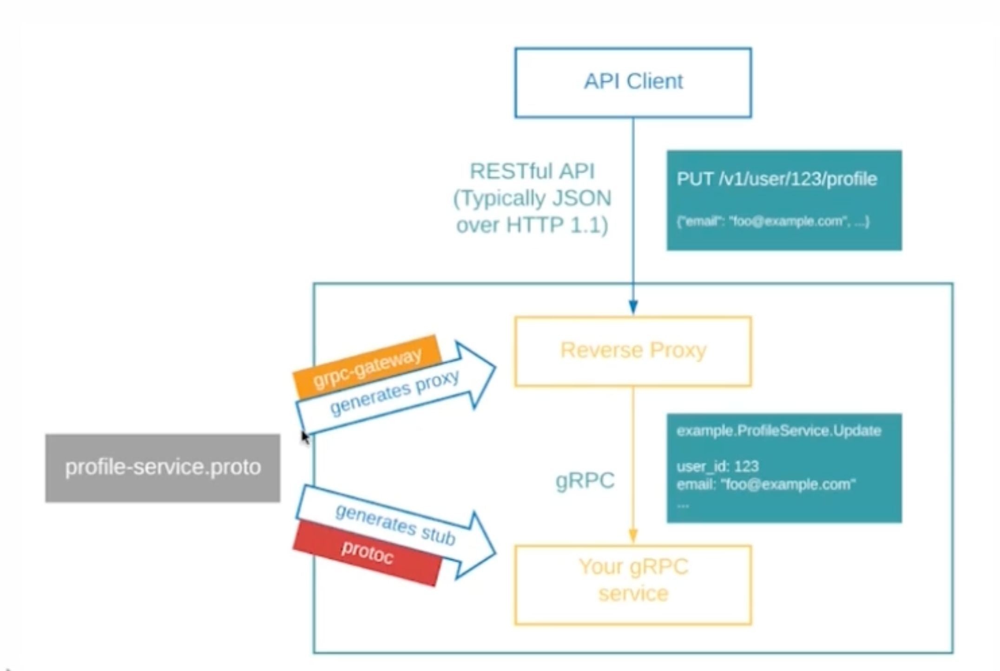

# Remote Procedure Call

In distribution computing, a **remote procedure call (RPC)** is when a computer program (subroutine) to execute in a different address space (commonly on another computer on a shared network), which is coded as if it where a normal (local) procedure call, without the programmer explicitly coding the details for the remote interaction.

## gRPC
1. RPC на базе Protocol Buffers
2. сообещения пересылаются по HTTP/2

### gRPC - определение схемы
```protobuf
service EntityService {
    rpc CreateEntity (CreateEntityRequest) returns (CreateEntityResponse);
}
```

```go
func (i *Implementation) CreateEntity(
    ctx context.Context,
    req *desc.CreateEntityRequest,
) (*desc.CreateEntityResponse, error)
{
    return &desc.CreateEntityResponse{
        // ...
    }, nil
}
```

## gRPC - возможные варианты
```protobuf
service HelloService {
    rpc SayHello (HelloRequest) returns (HelloResponse);

    rpc LotsOfReplies (HelloRequest) returns (stream HelloRequest);

    rpc LotsOfGreetings (stream HelloRequest) returns (HelloResponse);

    rpc BidiHello (stream HelloRequest) returns (stream HelloResponse)
}
```

# grpc-gateway
- Генерирует http ручки для grpc методов
- Генерирует swagger

