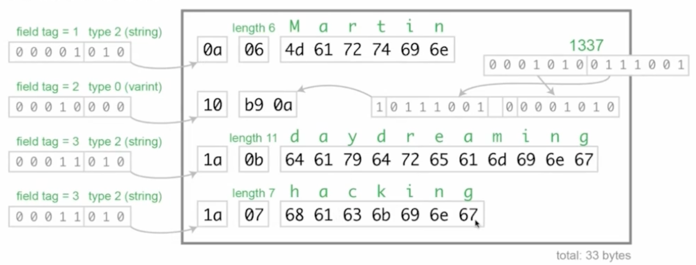

# Protocol buffers - `GRPC`

## Главные недостатки `JSON`
- большой размер данных
- медленный парсинг

## Что такое `Protocol Buffers`
- (эффективный) бинарный формат
- для (де)кодирования нужно знать схему
- парсеры/сериалазторы генерируются **для многих языков**
- фокус на обратную совместимость

## Типы данных - скалярые
```protobuf
message TestMessage {
    bool some_value = 1;
    uint8 some_uint8 = 2;
    double some_double = 3;
    string some_string = 4;
    bytes binary_data = 5;
}
```

Все типы - [документация по scalar-ным типам](https://developers.google.com/protocol-buffers/docs/proto3#scalar) 

## Сообщение может быть полем
```protobuf
message InnerMessage {
    string name = 1;
}

message Message {
    InnerMessage inner = 1;
}
```

## Типы данных - `repeated`
```protobuf
message Comment {
    string text = 1;
}

message TestMessage {
    repeated Comment comments = 1;
    repeated int64 ids = 2;
}
```

## Типы данных - `map`
- ключ - любой скалярный тип, кроме bytes и чисел с плавающей точкой

```protobuf
message Comment {
    string text = 1;
}

message MessageWithMap {
    map<string, SomeMessage> my_map = 1;
}
```

## Типы данных - `enum`
```protobuf
enum Status {
    UNKNOWN = 1;
    ENABLED = 2;
    DISABLED = 3;
}

message Message {
    Status status = 1;
}
```

## Типы данных - `oneof`
```protobuf
message NumericValue {
    string name = 1;
    oneof test_oneof {
        int64 int = 2;
        double float = 3;
        FormattedFloat = 4;
    }
}

message FormattedFloat {
    double float = 1;
}
```

## Вложенность
```protobuf
message NestedDemo {
    message NestedMessage {
        enum NestedEnum {
            ONE = 1;
            TWO = 2;
        }

        NestedEnum value = 1;
    }

    NestedMessage.NestedEnum result = 1;
}
```

# В `protobuf` невозможно отличить значение по умолчанию от отсутствия поля

## wrappers
```protobuf
import "google/protobuf/wrappers.proto";

message ParamValue {
    oneof value_oneof {
        google.protobuf.StringValue str = 1;
        google.protobuf.DoubleValue double = 2;
        google.protobuf.Int64Value int = 3;
        google.protobuf.BoolValue bool = 4;
    }
}
```

## timestamp
```protobuf
import "google/protobuf/timestamp.proto";

message Message {
    string text = 1;
    google.protobuf.Timestmap created_at = 1;
    google.protobuf.Timestmap updated_at = 1;
}
```

## Как хранятся сообщения


### Типы
| Type | Meaning          | Used For                                                                 |
| ---- | ---------------- | ------------------------------------------------------------------------ |
| 0    | Varint           | `int32`, `int64`, `uint32`, `uint64`, `sint32`, `sint64`, `bool`, `enum` |
| 1    | 64-bit           | `fixed64`, `sfixed64`, `double`                                          |
| 2    | Length-delimited | `string`, `bytes`, `embedded messages`, `packed repeated feilds`         |
| 3    | Start group      | groups (deprecated)                                                      |
| 4    | End group        | groups (deprecated)                                                      |
| 5    | 32-bit           | `fixed32`, `sfixed32`, `float`                                           |

### Varint
Varint делить число на 7 бит.  
Если в 7 бит не влезает - в старший разряд пишется 1 и в следующие 7 бит пишется число.  
Как только встречает 0 - заканчивает чтение.  

Экономит байты для длинных чисел (напр int64).  

- `field tag` + `type` - тоже varint
- `length` (напр строки) - тоже varint

### Repeated
Просто перечисление (один индекс - разные значения). Нет разницы между массивом из одного элемента и non-repeated field-ом.

### Строки
Кодировка - `utf-8`


## Обратная совместимость
- нельзя менять номер существующего поля
- можно добавлять/удалять поля
- нельзя добавлять новое поле на место старого номера! (reserved)

```protobuf
syntax = "proto3";

message SearchRequest {
    string query = 1;
    int32 page_numer = 2;
    int32 result_per_page = 3;
}

message SearchRequest {
    string query = 1;
    int32 page_numer = 2;
    reserved 3; // помечаем поле как reserved для будущего добавления полей
}
```

### Взаимозаменяемые типы
- типы `int32`, `uint32`, `int64`, `uint64` и `bool` - взаимозаменяемые (преобразования по правилам `C++`). Так как `Varint`
- `string` и `bytes` взаимозаменяемые (если передается валидная строка)
- сообщение можно заменить на `bytes` с сериализованным предствалением
- repeated может добавить/убрать у `bytes`, `string` и сообщений
- если убрать repeated - клиент увидет только последнее сообщение
- `int32`, `uint32`, `int64`, `uint64` взаимозаменяемые с enum
- можно превратить поле/ряд полей в `oneof`

## Философия
Любое поле является опциональным