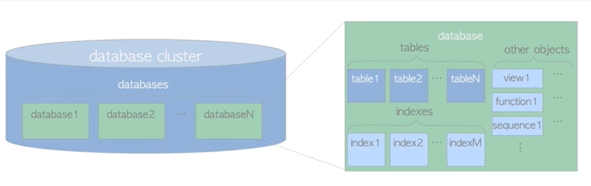
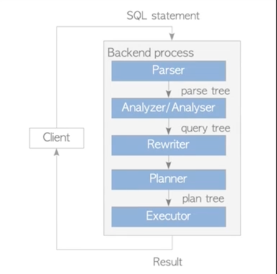
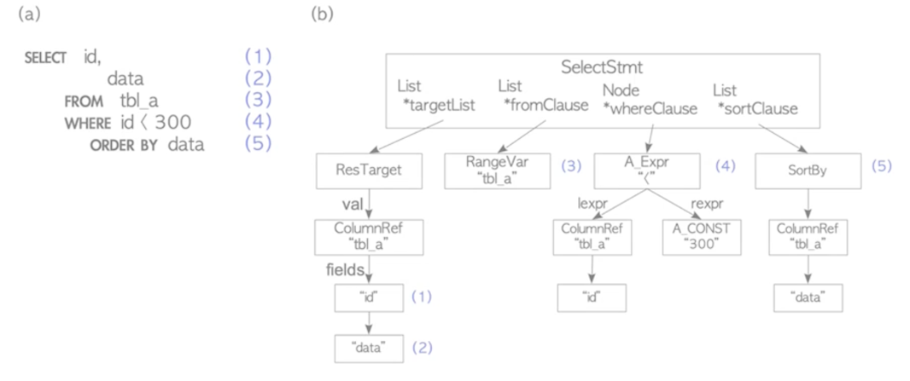
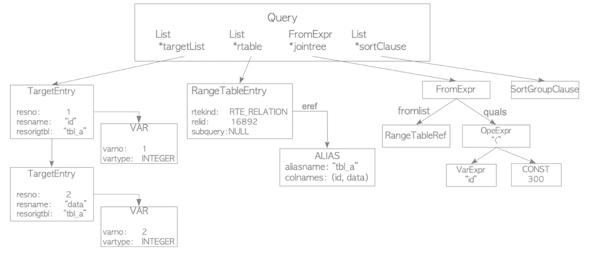
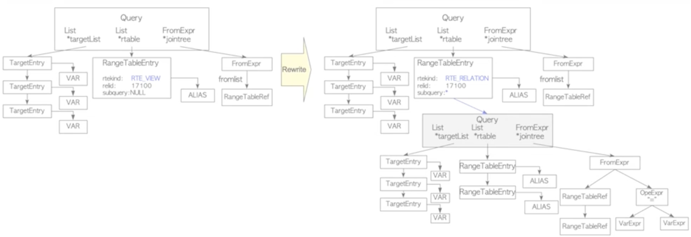
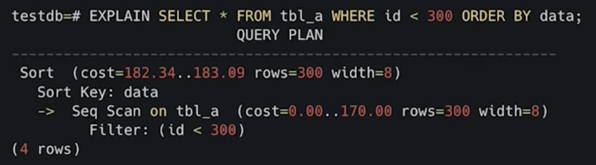
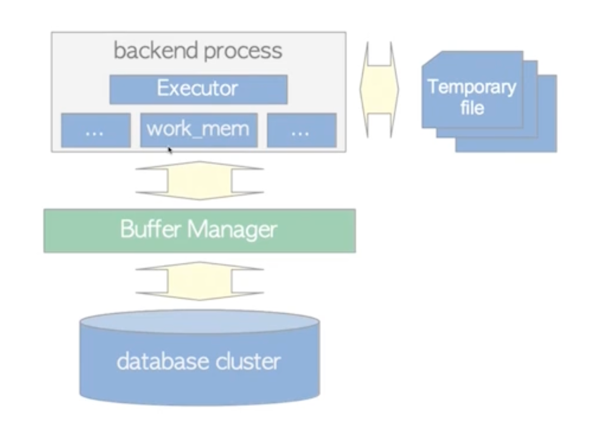

# PostgreSQL - Лекция 2
PostgreSQL - РСУБД

## Логическое устройство

## Особенности
- Базы имеют общие физические счетчики (WAL/OID)
- Базы не могут быть ограничены по общим физическим ресурсам (Memory/Disk/CPU)
- Нельзя в рамках одного подключения/сессии иметь подключение к двум БД на одном инстансе
- Для изоляции предполагается использовать scheme

## Обработка запросов

- Парсинг SQL запроса - поняли что хочет пользователь
- Семантический анализ дерева. Понимаем, к какой таблице происходит обращение
- Rewrite - если запрос происходит в view, котрое преобразовывается в другое дерево
- Планирование запроса
- Выполнение

### Parser

- Переводит текст запроса в синтаксическое дерево
- Работает без физического доступа к данным
- Не проверяет логические права доступа к данным

### Analyzer

- Выбирает подходящую таблицу из SearchPath-ов
- Определяет какие есть таблицы, колонки и типы
- Берет LOCK уровня чтения на системный каталог
- Происходит физическое обращение к данным и конкуренция за доступ

### Rewriter

### Planner

- Cost (стоимость) - вычисленная стоимость конкретных операций, не секунды и не миллисекунды (попугаи)
- Исходя из стоимости операции выбирается тот или иной план
- 3 вида затрат
  - startup
  - run 
  - total
- В зависимости от курсора или сразу все planner будет выбирать стоимость
- План выполняется снизу вверх
- По скрину
  - Сначала Seq Scan
  - Потом сортировка

#### Какой план лучше?
- Для обычных запросов - по минимальной общей стоимости
- Для курсоров - время получения первой строки (cursor_tuple_function)

Курсоры подходят для пагинации, это "лучше" чем limit/offset

С курсором клиент начнет обрабатывать раньше, чем psql завершит запрос. Сначала отдаст 1 строку и тд.  
**В продакшене не рекомендуется использовать курсоры**

#### Стоимости
- seq_page_cost - 1 - стоимость обращения при последовательном обращении с диска
- random_page_cost - 4 - 4 попугая стоит зачитать одну страницу индекса
- cpu_tuple_cost - 0.01
- cpu_index_tuple_cost - 0.005
- cpu_operator_cost - 0.0025

Последовательное чтение всегда быстрее.  
Значения стоит пересматривать для конкретного приложения.  
Параметры можно указывать для сессии или даже одной транзакции.  

### Executor

- У Executor-а есть собственная память work_mem

## Prepare && Execute
By default все этапы выполняются каждый раз

Почти все драйвера делают это:
- Многие драйвера по умолчанию это делают (и мы это теряем в случае с transaction_pool)
- Выполняется разбор и переписывание
- В случае без params выполняется сразу оптимизация (план)
- Иногда с PREPARE может сохраниться оптимизация (общий план)
- Данные сохраняются в локальной памяти Backend

