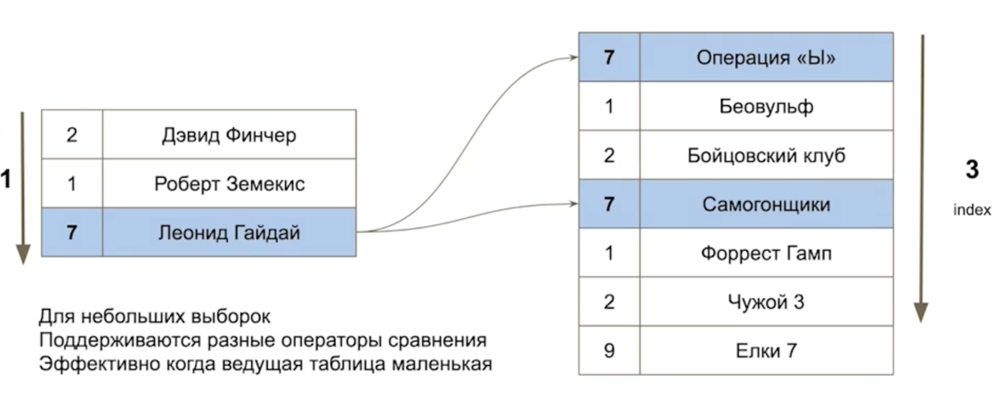

# PostgreSQL - Лекция 2

PostgreSQL - РСУБД

## Логическое устройство

## Особенности

- Базы имеют общие физические счетчики (WAL/OID)
- Базы не могут быть ограничены по общим физическим ресурсам (Memory/Disk/CPU)
- Нельзя в рамках одного подключения/сессии иметь подключение к двум БД на одном инстансе
- Для изоляции предполагается использовать scheme

## Обработка запросов

- Парсинг SQL запроса - поняли что хочет пользователь
- Семантический анализ дерева. Понимаем, к какой таблице происходит обращение
- Rewrite - если запрос происходит в view, котрое преобразовывается в другое дерево
- Планирование запроса
- Выполнение

### Parser

- Переводит текст запроса в синтаксическое дерево
- Работает без физического доступа к данным
- Не проверяет логические права доступа к данным

### Analyzer

- Выбирает подходящую таблицу из SearchPath-ов
- Определяет какие есть таблицы, колонки и типы
- Берет LOCK уровня чтения на системный каталог
- Происходит физическое обращение к данным и конкуренция за доступ

### Rewriter

### Planner

- Cost (стоимость) - вычисленная стоимость конкретных операций, не секунды и не миллисекунды (попугаи)
- Исходя из стоимости операции выбирается тот или иной план
- 3 вида затрат
    - startup
    - run
    - total
- В зависимости от курсора или сразу все planner будет выбирать стоимость
- План выполняется снизу вверх
- По скрину
    - Сначала Seq Scan
    - Потом сортировка

#### Какой план лучше?

- Для обычных запросов - по минимальной общей стоимости
- Для курсоров - время получения первой строки (cursor_tuple_function)

Курсоры подходят для пагинации, это "лучше" чем limit/offset

С курсором клиент начнет обрабатывать раньше, чем psql завершит запрос. Сначала отдаст 1 строку и тд.  
**В продакшене не рекомендуется использовать курсоры**

#### Стоимости

- seq_page_cost - 1 - стоимость обращения при последовательном обращении с диска
- random_page_cost - 4 - 4 попугая стоит зачитать одну страницу индекса
- cpu_tuple_cost - 0.01
- cpu_index_tuple_cost - 0.005
- cpu_operator_cost - 0.0025

Последовательное чтение всегда быстрее.  
Значения стоит пересматривать для конкретного приложения.  
Параметры можно указывать для сессии или даже одной транзакции.

### Executor

- У Executor-а есть собственная память work_mem

## Prepare && Execute

By default все этапы выполняются каждый раз

Почти все драйвера делают это:

- Многие драйвера по умолчанию это делают (и мы это теряем в случае с transaction_pool)
- Выполняется разбор и переписывание
- В случае без params выполняется сразу оптимизация (план)
- Иногда с PREPARE может сохраниться оптимизация (общий план)
- Данные сохраняются в локальной памяти Backend

idle_in_transaction_session_timeout - убить транзакцию если клиент молчит.

## Процессы СУБД

- shared memory - общая разделяемая память

### Postmaster

- Самый главный серверный процесс.
- Является родительским для любого из запущенных процессов.
- Инициализирует память.
- Принимает входящие соединения и запускает процессы для поддерживания системы в актуальном состоянии.
- Передает соединение Backend-у

### Backend Processes

- Обслуживает запросы клиентов
- Однопоточный: один клиент -> один запрос

### Background Processes

- `background writer` - подчищать глязные страницы в shared memory
- `checkpointer` - создает контрольные точки для отказоустойчивости. Если бы его не было postgres-у пришлось бы
  apply-ить все WAL-ы. Синхронизирует состояние shared memory на диск. После этого определенные части журнала могут быть
  удалены. Они больше не нужны для обеспечения отказоустойчивости
- `autovacuum launcher` - отдает сигнал для запуска autovacuum-а. Сам его не запускает.
- `WAL writer` - работает с куском памяти, в который записываются WAL-ы. Следит что бы этот кусок памяти не переполнялся
  и всегда было место. Сбрасывает данные на диск (последовательно)
- `statistics collector`

...

##### Vacuum

Многие БД ведут undo журнал, что нужно сделать, чтобы откатить транзакцию.
Undo журнала в Postgres нет. Все изменения записываются в данные на диске. Даже если был ROLLBACK.

Vacuum - очищает от таких грязных данных. Vacuum может запустить сам пользователь. Autovacuum - автоматический процесс,
который запускается сервером. Есть настройки, напр. Если 10% строк изменены - нужно запустить autovacuum.

#### Взаимозаменяемые типы

VARCHAR -> TEXT  
JSON -> TEXT

## Методы доступа

### Sequential Scan

- эффективно для получения всех данных (random)
- не эффективен для получения небольшой выборки

### Индексы: btree

- не хранит данных, которых нет в таблице -> всегда можно пересоздать
- влияют на производительность, но не на логику работы

### Index Scan

- эффективен для получения одного или нескольких значений
- не эффективно для получения всех значений

### Index Only Scan

- работает только по индексированным полям. Напр `select count(o.id) from orders o where o.category_id = 1` (при условии
  что есть index (id, category_id))

### Bitmap Scan

- эффективно для выборки среднего размера
- дополнительные расходы на построение битовой карты
- увеличивает шанс переиспользования кеша

## Inner/left/right/full/cross

Это логичкские операции, где механизмы - это nested loop, hash join и merge join которые могут выполняться во всех этих
случаях (зависит от эффективности)

### Планирование соединений

- PostgreSQL может строить план соединяя только пару таблиц
- Если обозримое количество планов - честно перебираем все
- Если количество таблиц большое (>=8), то используются генетические алгоритмы, PostgreSQL GEQO: сначала рандомно
  выбираются порядок соединения таблиц, выбираются с наилучшим планом исполнения и в дальнейшем запоминаются успешные
  порядки соединений

### Nested Loop

- первый цикл по ведущей таблице
- второй цикл в ведомой (вложенный). Возвращаемся ко второму набору ровно столько раз сколько элементов в 1 наборе

Эффективен когда у ведущей таблице набор строк небольшой

### Hash Join

- эффективен для большой выборки
- требует подготовительных действий по подготовке таблицы
- использует только равенство

### Merge Join

- эффективен для большой выборки
- требует подготовительных действий по подготовке таблицы (если нет индекса)
- возвращает отсортированный результат
- поддерживает только равенство (в postgresql)

## Additional Info

### Backend process == client

- Необходимо экономить кол-во подключений к PostgreSQL
- Каждый клиент - форк + начитывание cache
- ProcArray - это часть MVCC

Лучше не держать большое кол-во коннектов одновременно

### PgBouncer

Стоит использовать pgBouncer начиная от 100 коннектов к postgres.

### TOAST (The Oversized-Attribute Storage Technique)

- где хранится значение, зависит от типа и размера
    - менее 2кб - не применяется компрессия
    - от 2кб - пробуется компрессия и если умещается на странице - попадает в страницу
    - не умещается в страницу - едет в TOAST

### Компрессия - это хорошо или плохо?

- Зависит от ситуации
- Если не HOT-update, то все грустно

### JSON(b)

#### Планер работает на статистике, а для json(b) ее нет

- ООМ (out of memory)
- Не предсказуемое время ответа
- Спасает ситуацию btree(json_date->field)

### GIN

#### (fast-update = true)

- Работает быстро
- Пока не придет время расплаты и одному запросу придется выполнить все на что забили другие (gin_pending_list)
- db.Query(ctx, ) - мы же считаем что запросы выполняются быстро? :)

### Реплики для чтения?

#### synchronous_commit

Реплики в postgres не для чтения и уменьшения нагрузки, а для **отказоустойчивости**.  
Не строит выполнять долгие запросы из реплики

> А что если писать в мастер, а читать только из реплик? 

Когда бэкенд читает - он сбрасывает грязные страницы. На мастер тоже нужно нагрузка на чтения.

