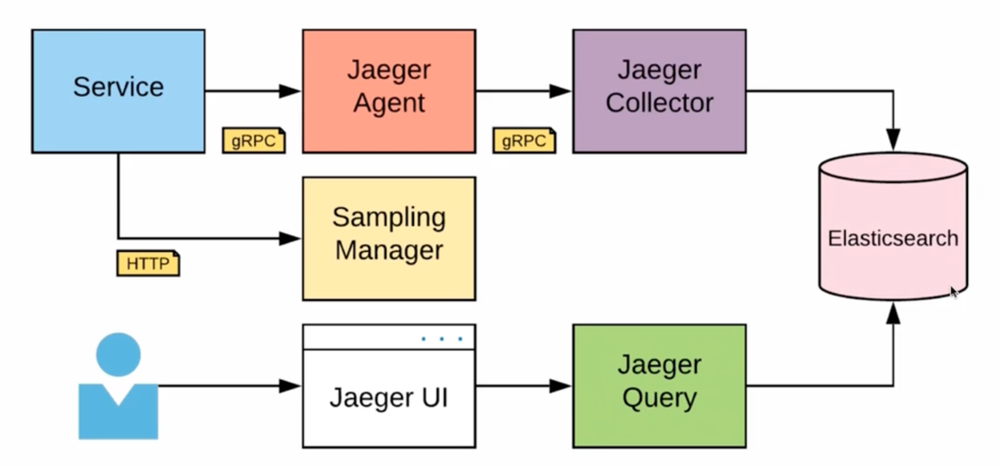
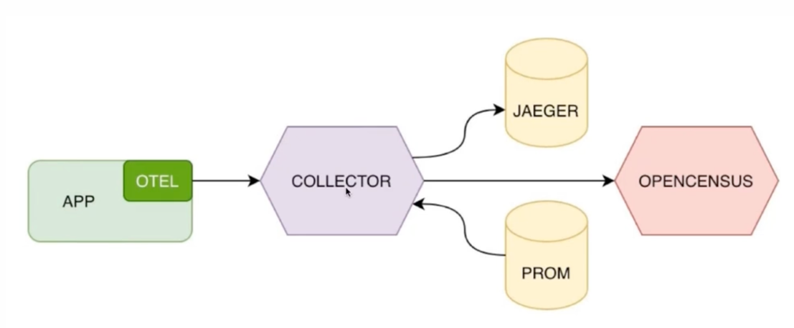

# Observability

Делится на 
- logging - информация о событиях
- tracing - информация о прохождении запросов между микросервисами
- monitoring - информация об общем состоянии системы

## logging

### Формы логирования

Стандартная библиотека go "logger". 

- умеет только plain text logging. 
- не умеет в уровни логирования
- мало кто использует
```go
log.Printf("error occurred, %v", err)
```

Библиотеки для логирования  
`uber-go/zap` - performance+sugar.  
`rc/zerolog` - фокус на zero-allocation (отсутствие выделений памяти на куче)
`sirupsen/logrus` - не самый быстрый, но много плагинов

### Библиотека логирования - zap
```go
logger.Info("failed to fetch URL",
	// Structured context as strongly typed Field values.
	zap.String("url", url),
	zap.Int("attempt", 3),
	zap.Duration("backoff", time.Second),
)
```

### Библиотека логирования - zap (sugar)
```go
sugar := logger.Sugar()

sugar.Infow("failed to fetch URL",
	// Structured context as loosely typed Field values.
	"url", url,
	"attempt", 3,
	"backoff", time.Second,
)

sugar.Infof("Failed to fetch URL: %s", url)
```

### Библиотека логирования - zerolog

```go
log.Debug().
	Str("Scale", "833 cents").
	Float64("Interval", "833.00").
	Msg("Fibonacci is everywhere")
```

### Библиотека логирования - logrus

```go
log.WithFields(log.Fields{
	"animal": "walrus",
	"size": 10
}).Info("A grou of walrus emerges from the ocean")
```

### stern
позвояет получить логи сразу с нескольких подов

### Graylog

https://docs.graylog.org/docs/query-language

## Уровни логирования
- DEBUG - для локальной разработки/отладки
- ERROR - сообщения об ошибках
- WARN - ошибки неверного ввода (kafka/RPC)
- INFO - остальные

### Уровни логирования - Syslog
- DEBUG - 7
- ERROR - 3
- WARN - 4
- INFO - 6

### Какой уровень логирования выбрать?
- DEBUG - локально
- INFO/WARN - на STG/PROD

### Паттерны переопределения уровня
- Переопределение уровня логирования в realtime-конфиге
- Переопределение уровня логирования для конкретного запроса

### Паттерн - переопределение уровня для запроса
- с помощью заголовка можно на уровне контекста переопределить дефолтный уровень логирования

## Что писать в лог
- Ошибки
- Статус фоновых вопросов
- Начало/конец запросов (только в Debug)
- Полученные/отправленные в очередь сообщения (только в DEBUG)
- Все, что душа пожелает

### Как писать в лог
- Префикс фонового процесса
- Префикс метода
- Truncate чувствительных данных
  - логин/пароль/токен авторизации
  - (осторожно с логирующими middleware)

## Tracing
### Jaeger - Архитектура


### Jaeger - Подключение
```go
import "github.com/uber/jaeger-client-go/config"

traceCfg := &config.Configuration{
	ServiceName: "example-service",
	Sampler := &config.Sampler{
        Type: "const", // фиксированная частота отправки трейсов
        Param: 1.0, // отправляем 100% трейсов 
    },
}

tracer, closer, err := cfg.NewTracer()
if err != nil {
	return err
}

opentracing.SetGlobalTracer(tracer)
```

### Паттерн - привязка trace-id
- К запросам
- К логам

### OpenTelemetry
- OpenTracing устаревает. На замену приходит OpenTelemetry
- По-сути OpenTelemetry - это прокси для системы трейсингов
- Умеет переносить трейсы из одной системы в другую
- Стандартизирует стандарт не только с трейсами, но и с метриками



### Что почитать?

- GraylogQuery Language - https://docs.graylog.org/docs/query-language
- Trace/Span Identity - https://www.jaegertracing.io/docs/1.27/client-libraries/#tracespan-identity
- OpenTelemetryна практике - https://habr.com/ru/company/ru_mts/blog/537892/