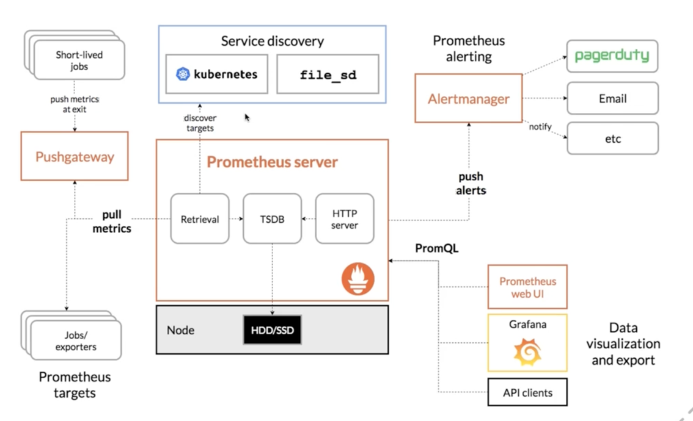

[# Monitoring

## Metrics

> поименованная серия числовых значений во времени, обычно через равные (или почти равные интервалы)

- метрик обычно сильно больше чем логов
- получение метрик не должно влиять на работу приложения
- метрики могут иметь погрешность
- проектируйте метрики

## SLI, SLA, SLO

Service Level Indicator (SLI) - количественная оценка работы сервиса.

Service Level Objectives (SLO) - желаемое, количественное значение нашего SLI (или группы SLI).

Service Level Agreement (SLA) - установленное бизнесом внешнее обязательство по доступности сервиса перед клиентами.

Примеры SLI:

- время обработки запроса пользователя
- процент успешно обработанных запросов

Например:

- 99.9% обрабатываются менее чем за 5 секунд
- 99.9% запросов должны обрабатываться без ошибок

Такая формулировка дает нам одну производную метрику - процент времени, когда все SLI находятся в SLO диапазоне.
То есть все условия важные для пользовательского опыта выполнены.
У этой метрики есть свой SLO, например, 99.9% времени мы хотим, что бы все наши важные условия для пользователя
выполнялись.

- показатели SLI сильно коррелируют с качеством обслуживания пользователей
- для работы крайне важны четкие понимания SLI и SLO

Начинать работу надо именно с того, чтобы разобраться, что у нас за сервис и что именно важно нашим пользователям.

## Prometheus

### Prometheus - Архитектура



### Pushgateway

Push-модель рекомендуется использовать лиш в определенных частных случаях, так как имеет недостатки:

- единая точка отказа в виде pushgateway
- Prometheus больше не знает живо-ли приложение
- Prometheus хранит time-series полученные от приложения "вечно" (пока не почистят ручками)

Pushgateway рекомендуется использоваться лишь в случаях короткоживущих приложений (например cron job), когда времени
работы приложения недостаточно для скрейпа.

https://prometheus.io/docs/practices/pushing/

### inf

- процесс сбора метрик называется скрейп (scrape)
- по-умолчанию Prometheus:
    - скрейпит метрики у приложений через HTTP endpoint /metrics
    - использует протокол HTTP (без TLS)
    - выполняет скрейп с интервалом 10 секунд
- push-модель рекомендуется только для короткоживущих приложений
- push-модель подразумевает, что приложение само отправляет метрики на Pushgateway, из которых их забирает Prometheus

### Размер данных

- 8 байт на одно значение метрики
- скрейпинг с интервалом раз в 30 секунд - ~23KB на одну метрику в сутки
- за 2 месяца ~1.3MB данных
- кол-во серверов 500 - ~675MB данных
- 10 графиков на борде - ~7GB данных для обновления борды

### PromQL

> PromQL - это язык запросов используемый Prometheus.

PromQL отличается от других языков запросов к time-series базам данных, таких как SQL, InfluxQL, Flux или языка
запросов, используемых в Graphine

PromQL поддерживает типы данных:

- Instant vector множество time-series, каждое из которых содержит:
    - одно измерение
    - общий timestamp
- Range vector множество time series, каждое из которых содержит:
    - диапазон измерений во времени
- Scalar простое число с плавающей точкой
- String простое строковое значение (не используется)

### Time series

Time series состоит из имени метрики, лейблов и значения

```promql
<metric name>{<label name>=<label value>, ...} <sample>
```

Значения могут быть представлены как:

- float64
- timestamp (миллисекунды)

Пример:

```promql
api_http_requests_total{method="POST", handler="/messages"} 123
```

#### Требования

- имя метрики должно быть в формате <где>_<что>_<единицы измерения>, напр, `one_inc_database_query_duration_seconds` (
  кроме тех, что репортятся клиентом prometheus). Если единиц измерения нет - принято подписывать как total
- в лейлблах не используйте значения с высокой кардинальностью: ID, email, datetime, и т.п. (у нас максимальная
  вариативность 50 значений)

### Запросы

Получение всех time series для метрики с названием `http_requests_total`:

```promql
http_requests_total
```

Имеется несколько вариантов для фильтрации по label:

- `=` - простые сравнения "равно"
- `!=` - простые сравнения "не-равно"
- `=~` - regex-сравнения равно
- `!~` - regex-сравнение не равно

Фильтр по соответствующим значениям label:

```promql
http_requests_total{job="prometheus",group="canary"}
```

Фильтрация по соответствующим значениям label с использованием regex:

```promql
http_requests_total{environment=~staging|testing|development,method!="GET"}
```

### Range vector

Можно получить добавив Time Duration в скобках [], например:

```promql
http_requests_total{job="prometheus"}[5m]
```

Допустимые значения для time duration:

- ms - миллисекунды
- s - секунды
- m - минуты
- h - часы
- d - дни (24h)
- w - недели (7d)
- y - год (365d)

## Клиентский модуль Prometheus для Go

```shell
go get github.com/prometheus/client_golang/prometheus
go get github.com/prometheus/client_golang/prometheus/promauto
go get github.com/prometheus/client_golang/prometheus/promhttp
```

Пример простейшего приложения с доступными метриками через localhost:2112/metrics

```go
package main

import (
	"net/http"

	"github.com/prometheus/client_golang/prometheus/promhttp"
)

func main() {
	http.Handle("/metrics", promhttp.Handler())
	http.ListenAndServe(":2112", nil)
}
```

### Собственные метрики Prometheus

docker-compose.yaml

```yaml
services:
  prometheus:
    image: prom/prometheus:latest
    volumes:
      - /prometheus.yml:/etc/prometheus/prometheus.yml:ro
      - /prometheus:/data:rw
    ports:
      - target: 9090
        published: 9090
        protocol: tcp
        mode: target
```

prometheus.yml

```yaml
scrape_configs:
  - job_name: "prometheus"
    static_configs:
      - targets: [ "localhost:9090" ]
```

- официальный Go модуль включает набор метрик "из коробки"
- Prometheus предоставляем метрики для себя

## Типы метрик

### Counter (счетчик)

Простой тип метрик, значение которого может только увеличиваться

```text
# HELP process_cpu_seconds_total Total user and system CPU time spend in seconds.
# TYPE process_cpu_seconds_total counter
process_cpu_seconds_total 0.53
```

Когда нужно использовать счетчик?

- когда значение только увеличивается
- когда мы хотим узнать насколько быстро значение увеличивалось

Примеры:

- счетчик запросов
- счетчик ошибок
- счетчик завершенных задач

#### Интерфейс

```go
type Counter interface {
Metric
Collector

Inc()
Add(int64)
}
```

```go
import "github.com/prometheus/client_golang/prometheus/promauto"

var metricProccessedOpsTotal = promauto.NewCounter(prometheus.CounterOpts{
Name: "myapp_processed_ops_total",
Help: "The total number of processed events"
})
```

### Функция sum()

Считает сумму по измерениям.

Посчитать с разбивкой по application и group

```
sum by (application, group) (http_requests_total)
```

Сгруппировать все лейблы instance:

```text
sum without (instance) (http_requests_total)
```

Подсчет кол-ва свободной памяти в MiB:

```text
(instance_memory_limit_bytes - instance_memory_usage_bytes) / 1024 / 1024
```

Тот же подсчет, но с суммированием по лейблу app:

```text
sum by (app) (
    instance_memory_limit_bytes - instance_memory_usage_bytes
) / 1024 / 1024
```

### Функция rate(v range-vector)

Считает среднюю скорость (единиц в секунду) увеличивая значение метрики. Пример запроса на количество HTTP запросов в
секунду за последние 5 минут

```text
rate(http_requests_total{job="api-server"}[5m])
```

Функция rate должна быть использована только со счетчиками. При использовании вместе с функцией sum, функция rate должна
быть вызвана первой:

Так можно:
```text
sum by (job) (rate(http_requests_total))
```
